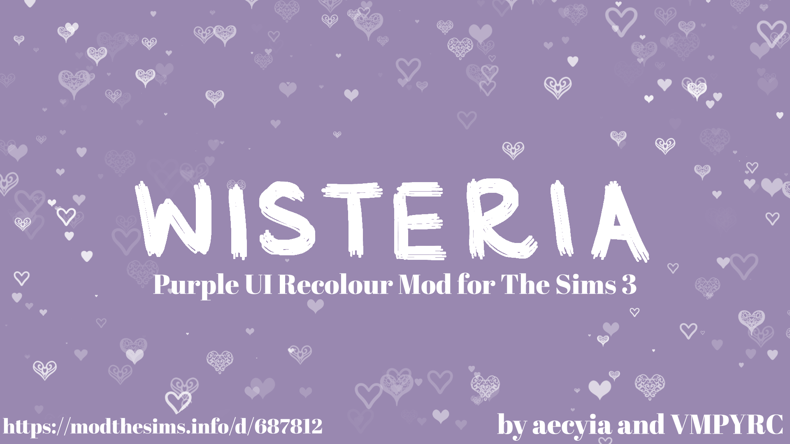

🚨 Project Status  🚨

> ⚠️ **This project is currently stalled** and not under frequent development.

# Wisteria ♡

A Purple UI for The Sims 3

## Installation

1. Set up your Mods Folder via [this guide](https://modthesims.info/wiki.php?title=Game_Help:Installing_Sims_3_Package_Files/Setup_and_Files)
2. Go to [Releases](https://github.com/aecyia/Wisteria/releases) -- Instructions are there too
3. Download the `.package` file included under Assets
4. Move to `Documents\Electronic Arts\The Sims 3\Mods\`
5. Place in Overrides OR Packages
6. Play + Enjoy
7. Have an idea / suggestion? Found a visual issue? Send feedback [here](https://github.com/aecyia/Wisteria/issues)

## Warnings

- Only use one recolour mod at a time! This will conflict with any other mod that changes the UI image assets and LAYOUT files. You can prioritize via "Resource.cfg" in your Mods folder.
- The colours may appear different based on your computer's brightness and colour settings. Especially when taking screenshots, it may come out as super saturated.
- Wisteria is built using
  - Steam version
  - The Sims 3 version 1.67.2.024037
  - With all the Expansion and Stuff Packs (except Sweet Treats)
  - Manual edits through a digital art software, and not through scripted / batch actions
    - As a result, some visuals may appear as their default image. Please report any issues [here](https://github.com/aecyia/Wisteria/issues) ♡

## Terms of Usage

Uploading terms:
- Do not upload to the Sims 3 Exchange.

General terms:
- Please give credit with a link when using my work.
- Ask me first before modifying/using.
- Let me know if you use my work.

## ♡

- Aesthetic -- Purple > Blue > Pink > Green
- Follows the folder structure of [TS3-Starter-UI](https://github.com/VMPYRC/TS3-Starter-UI)
- Original tumblr [post](https://www.tumblr.com/simmanity/766360206910357504/)
- More screenshots in these [discussions](https://github.com/aecyia/Wisteria/discussions/)
- ModTheSims upload [submission](https://modthesims.info/d/687812)

[aecyia](https://github.com/aecyia) ♡ [VMPYRC](https://github.com/VMPYRC) ♡ Wisteria ♡ 2024
